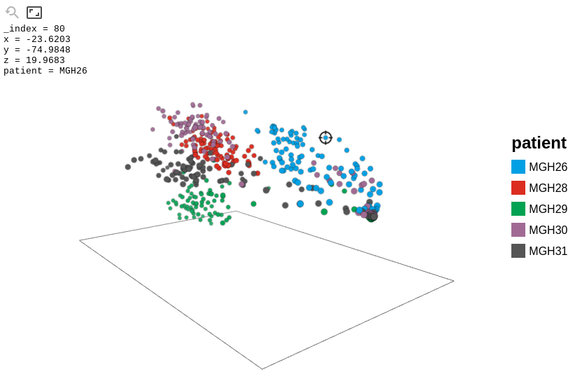

ZP: 3D scatter plot
===================

ZP leverages **WebGL** and implements **relational-data plotting language** (similar to `ggplot2` in R),
presenting an elegant way to visualize data points with interactive 3D graphics.

Language Supported
------------------

Due to its simple interface, ZP can be easily ported to other languages.

* [R interface](https://github.com/w9/zp-r)

Features
--------

* WebGL interactive 3D graphics
* great performance for upto 1,000 points (10,000 if your have a decent GPU)
* ggplot2-like relational data language (which means legends are drawn automatically)
* allows for picking data dynamically
* allows for adjusting of aspect ratio
* orthogonal views

Screencast
----------

[https://gfycat.com/HeartfeltScaredAsiandamselfly](https://gfycat.com/HeartfeltScaredAsiandamselfly)

Screenshot
----------

